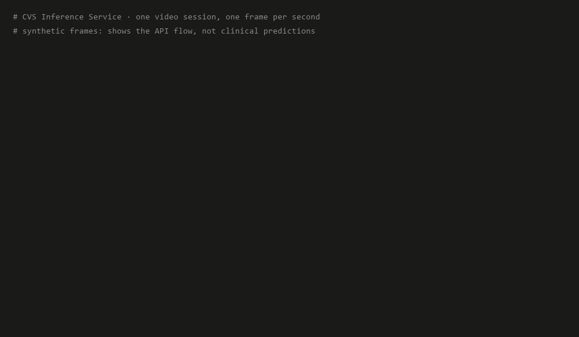
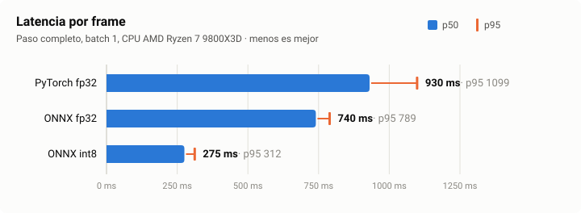

# CVS Inference Service

**English** · [Español](README.es.md)

Real-time inference service for assessing the **Critical View of Safety (CVS)**
in laparoscopic cholecystectomy video. It takes the research model
**PercEVA-CVS** (SafeSurg, MICCAI 2026) and turns it into a deployable API:
numerically verified ONNX export, INT8 quantization, reproducible latency
benchmarks and a PyTorch-free Docker image.

> **Research tool.** It is not a medical device and must not be used to make
> clinical decisions.



<sub>Real session against the service (int8, 16 threads, CPU) with synthetic
frames: it shows the API flow and latency, not clinical predictions; the
probabilities of a synthetic frame are meaningless. Responses summarized on one
line. Generated with `scripts/make_demo.py`.</sub>

## What it does

In a cholecystectomy, before cutting the cystic duct and artery, the surgeon
must confirm three visual criteria (the CVS). The service receives the video at
1 frame per second and, for every frame, estimates whether each criterion is
met using the last 15 seconds of context:

```
frame (JPG/PNG)
   │  preprocess          resize to 448×448, ImageNet normalization
   ▼
encoder.onnx              EVA-02 Large → 1024-d embedding (once per frame)
   │
   ▼
session window            last 15 embeddings, in memory
   │
   ▼
perceiver.onnx            gated temporal Perceiver → C1, C2, C3
```

The encoder runs once per frame and its output stays in the session window, so
each request costs one encoder pass instead of fifteen.

## Results

### Accuracy (SAGES 2024 CVS Challenge)

| Model | Extra supervision | macro mAP |
|---|---|---|
| LG-CVS (published baseline) | boxes | 57.6 ± 0.4 |
| **PercEVA-CVS** | none | **65.1 ± 1.3** |

Averaged over three seeds (42, 1, 50). These are the paper's figures, not
re-measured here. The service loads the published weights with `strict=True`;
the adapted Perceiver matches the original code with a difference of 0.0, and
the fp32 ONNX models differ from PyTorch by at most 4.8e-6.

### Latency

<picture>
  <source media="(prefers-color-scheme: dark)" srcset="docs/latency-dark.svg">
  
</picture>

<!-- bench:start — generated by benchmarks/bench_latency.py, do not edit by hand -->
| Backend | Precision | p50 (ms) | p95 (ms) | Throughput | Size | Δ accuracy |
|---|---|---|---|---|---|---|
| PyTorch | fp32 | 930.4 | 1098.6 | 1.07 frames/s | 1264.8 MB (weights in memory) | reference |
| ONNX Runtime | fp32 | 740.4 | 789.1 | 1.35 frames/s | 1267.9 MB | parity with PyTorch: max diff 4.8e-6 |
| ONNX Runtime | int8 (dynamic) | 275.5 | 311.9 | 3.63 frames/s | 341.7 MB | +0.3 mAP pts (95% CI: -0.4 to +0.9) |

Full per-frame step at batch 1 (EVA-02 Large encoder at 448×448, temporal
window and Perceiver), which is what the API does on every request; the encoder
is over 95% of the time. Throughput = 1000 / p50, frames processed
sequentially. CPU AMD Ryzen 7 9800X3D 8-Core Processor, no GPU,
Windows-11-10.0.26200-SP0, 16 threads for every backend; PyTorch 2.14.0+cpu,
ONNX Runtime 1.30.0 (thread spinning disabled, as in the service), Python
3.14.3. 120 iterations after 15 warm-up, 2 runs per stage (p50 variation < 2%),
each backend in its own process. Script: `benchmarks/bench_latency.py`; raw
data in `benchmarks/results.json`.

For int8: across 60 of the 300 SAGES 2024 test videos (randomly chosen with
seed 0; 1080 keyframes, majority-vote labels), macro mAP goes from 63.8 with
fp32 to 64.2 with int8 (+0.3 points; 95% video-bootstrap CI: -0.4 to +0.9). The
decision at the 0.5 threshold agrees in 98.3% of cases. It is a subset of the
test split, so its absolute mAP is not comparable with the paper's; what it
measures is the difference between precisions on the same frames. Script:
`benchmarks/eval_map.py`.
<!-- bench:end -->

## Quick start

### 1. Weights and ONNX export

The weights are published by the authors in the
[original repository](https://github.com/BCV-Uniandes/PercEVA-CVS#pre-trained-weights)
(`perceva_cvs_weights_v1.zip`). This repository does not redistribute them.

```bash
uv sync                                   # dependencies, including torch for the export
unzip perceva_cvs_weights_v1.zip          # creates perceva_cvs_weights/
uv run python -m cvs_serve.onnx_export --weights perceva_cvs_weights/sages2024
```

The export checks parity with PyTorch (batch 1 and 3) before quantizing and
writes `encoder.onnx`, `perceiver.onnx` and their `.int8.onnx` versions to
`models/`. If parity fails, it stops without quantizing.

### 2. Run the API

With Docker (torch-free image; models are mounted, not copied):

```bash
docker build -t cvs-serve .
docker run -p 8000:8000 -v "$(pwd)/models:/models:ro" cvs-serve
```

Or locally:

```bash
uv run uvicorn cvs_serve.api:app
```

Interactive docs are served at `http://localhost:8000/docs`.

On Windows, use `127.0.0.1` instead of `localhost` when testing locally:
uvicorn listens on IPv4 only and the client tries IPv6 first, which adds
~200 ms to every connection (measured: 500 ms vs 285 ms per frame).

## API usage

One session per video. Frames are sent at 1 fps, in order, from the start of
the procedure.

```bash
# Open a session
curl -X POST localhost:8000/sessions
# {"session_id": "b4cd...", "window_size": 15, "expected_fps": 1.0}

# Send a frame (repeat every second)
curl -X POST localhost:8000/sessions/b4cd.../frames -F "file=@frame.jpg"
# {"frame_index": 0,
#  "probabilities": {"c1": 0.60, "c2": 0.55, "c3": 0.62},
#  "criteria": {"c1": true, "c2": true, "c3": true},
#  "cvs_achieved": true, "window_filled": 1, "window_size": 15, ...}

# Close the session
curl -X DELETE localhost:8000/sessions/b4cd...
```

`cvs_achieved` is true only when all three criteria are met (0.5 threshold).
`window_filled` tells how many of the 15 seconds of context are available;
during the first 14 frames the model sees less history.

| Endpoint | Response |
|---|---|
| `GET /health` | status, loaded precision and active sessions |
| `POST /sessions` | `201` with `session_id`; `503` if the limit is reached |
| `POST /sessions/{id}/frames` | prediction; `404` unknown or expired session, `400` invalid image, `413` over 10 MB |
| `DELETE /sessions/{id}` | `204`; `404` if it does not exist |

### Configuration

| Variable | Default | |
|---|---|---|
| `CVS_MODELS_DIR` | `models` (`/models` in Docker) | directory with the `.onnx` files |
| `CVS_PRECISION` | `int8` | `int8` or `fp32` |
| `CVS_MAX_SESSIONS` | `32` | concurrent sessions |
| `CVS_SESSION_TTL_S` | `300` | seconds of inactivity before a session expires |
| `CVS_NUM_THREADS` | `0` | ONNX Runtime threads; `0` = automatic |

## Limitations

- **No out-of-distribution detection.** It assigns probabilities to any image,
  even noise; an image that is not surgery can return `cvs_achieved: true`.
- **Assumes 1 fps from the start of the video.** Each frame's temporal
  position is its index, as in training. Skipping frames or starting mid-
  procedure gives the model a different context from the one it saw.
- **Sessions longer than 34 minutes.** The learned position table covers
  2048 s; beyond that the position stays fixed at 2047, a case the model never
  saw in training.
- **In-memory state.** Sessions live in the process: one worker per container
  and, with several replicas, session affinity at the load balancer.
- **int8 validated on a subset.** The comparison with fp32 uses 60 of the 300
  test videos of
  [SAGES 2024](https://huggingface.co/datasets/CAMMA-public/SAGES_CVS_Challenge_2024);
  the full test split would give a narrower interval.

## Development

```bash
uv sync                                    # development dependencies and torch
uv run pytest                              # tests (tiny models, no clinical data)
uv run ruff check . && uv run ruff format --check .
uv run python benchmarks/bench_latency.py --readme             # latency and both READMEs' table
uv run python scripts/make_latency_chart.py                     # charts (en/es) from results.json
uv run python scripts/make_demo.py                              # demo.gif and demo.es.gif (real session)

# fp32 and int8 mAP on SAGES 2024; downloads the videos outside the repo
uv run --group eval python benchmarks/eval_map.py --data ../datasets/SAGES_2024 --n-videos 60
```

```
src/cvs_serve/
├── config.py        model constants and service settings
├── model.py         preprocessing, temporal window, weight loading, ONNX predictor
├── perceiver.py     temporal Perceiver (adapted from the original repository)
├── onnx_export.py   export, parity check and quantization
└── api.py           FastAPI endpoints and sessions
```

## Attribution and license

Based on **PercEVA-CVS**: S. Cañar, J. S. Vera, I. S. Tovar, P. Arbeláez,
"Annotation-Efficient Critical View of Safety Assessment with Vision Foundation
Models", SafeSurg Workshop, MICCAI 2026.
[Original code](https://github.com/BCV-Uniandes/PercEVA-CVS) — CC BY-NC-SA 4.0.

This repository inherits the **CC BY-NC-SA 4.0** license ([`LICENSE`](LICENSE));
attribution and the changes from the original are in [`NOTICE`](NOTICE).
